## Principal Investigator

:::: {.people-grid .people-grid-featured}

::: {.person-card}
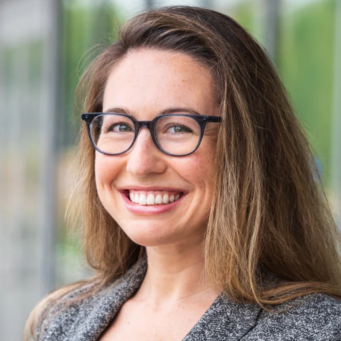{.person-photo fig-alt="Portrait of Rachel Ryskin"}

### [Rachel Ryskin](https://raryskin.github.io/)

Rachel Ryskin is the lab PI & an Associate Professor in Cognitive &
Information Sciences.
:::

::::

## Research Staff

:::: {.people-grid .people-grid-featured}

::: {.person-card}
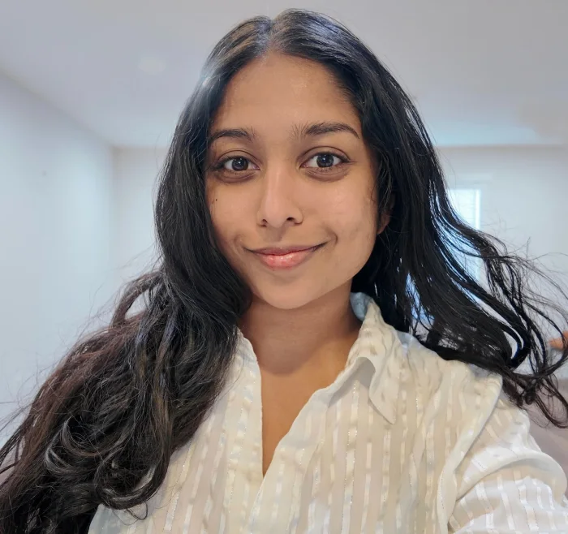{.person-photo fig-alt="Portrait of Saloni Naik"}

### [Saloni Naik](https://salonisnaik.github.io/)

Saloni Naik is the LInC lab manager.
:::

::::

## Graduate Students

:::: {.people-grid}

::: {.person-card}
{.person-photo fig-alt="Portrait of Ellis Cain"}

### [Ellis Cain](https://ellisc.dev/)

Ellis Cain is a 5th year PhD student in Cognitive & Information Sciences.
:::

::: {.person-card}
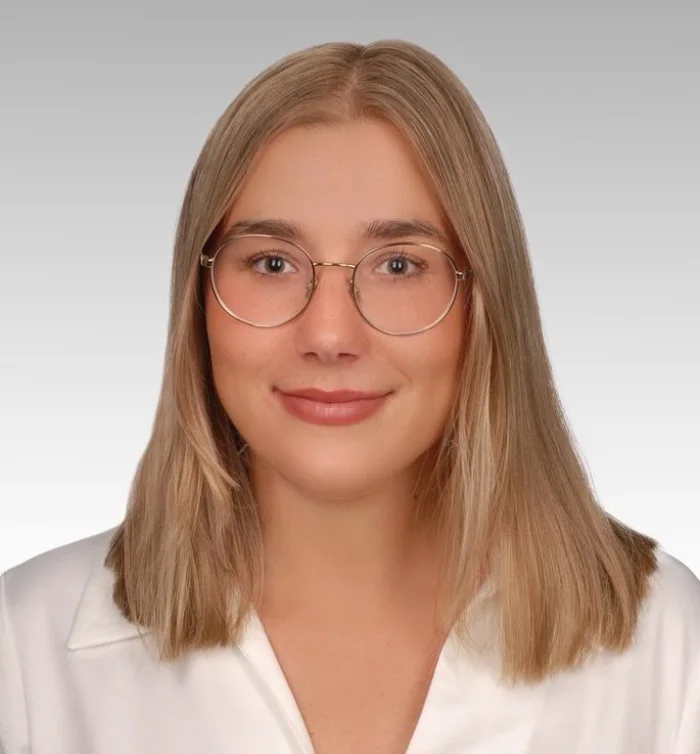{.person-photo fig-alt="Portrait of Olivia Gawel"}

### Olivia Gawel

Olivia Gawel is a 2nd year PhD student in Cognitive & Information Sciences.
:::

::: {.person-card}
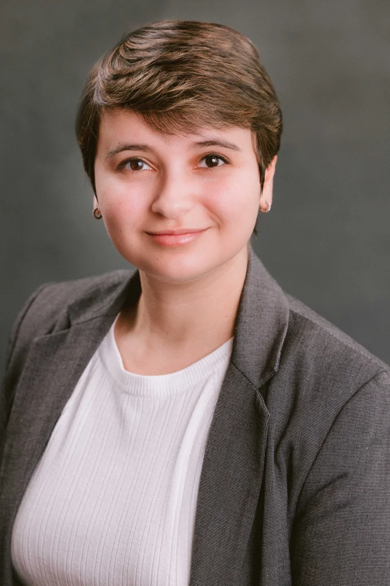{.person-photo fig-alt="Portrait of Yasemin Gokcen"}

### Yasemin Gokcen

Yasemin Gokcen is a 4th year PhD student in Cognitive & Information Sciences.
:::

::: {.person-card}
{.person-photo fig-alt="Portrait of Tevin Williams"}

### Tevin Williams

Tevin Williams is a 5th year PhD student in Cognitive & Information Sciences.
:::

::::

## Undergraduate Research Assistants

:::: {.name-grid}

::: {.name-card}
Ellis Hampton
:::

::: {.name-card}
Mereal Jarjour
:::

::: {.name-card}
Jonathan Rivera Lopez
:::

::: {.name-card}
Joe Shem
:::

::: {.name-card}
Devlan Smith
:::

::::

## Former Lab Members

### Graduate

Richard Ellks, M.S. 2022 (➝ research coordinator at Stanford)

Joyce Liu, M.S. 2023 (➝ PhD student at UC Merced)

### Post-bacc

Alyssa Ortega (➝ PhD Student at UW Madison)

Dulce Karina Pimentel-Hurlburt (➝ Clinical Research Coordinator Associate at Stanford)

### Undergraduate

Alton Chao (➝ PhD student at Purdue University)

Nora Chen

Isaac Corona

Isabella Dohnke

Tina Fathollahi

Jacob Lawson

Jet Mejia-Bohol

Aryaan Mishra

Ma Angela Montiel (➝ PhD student at UC Santa Cruz)

Vera Nicolette-Sanchez (➝ UC Merced)

Eduardo Santiago

Renisha Singh

Sukanya Sriram

Rich Truong

Levi Williams

## Lab Photos

::: {.gallery-section}
### PhD Graduation 2026

:::: {.photo-gallery .photo-gallery-featured}

::: {.gallery-item}
[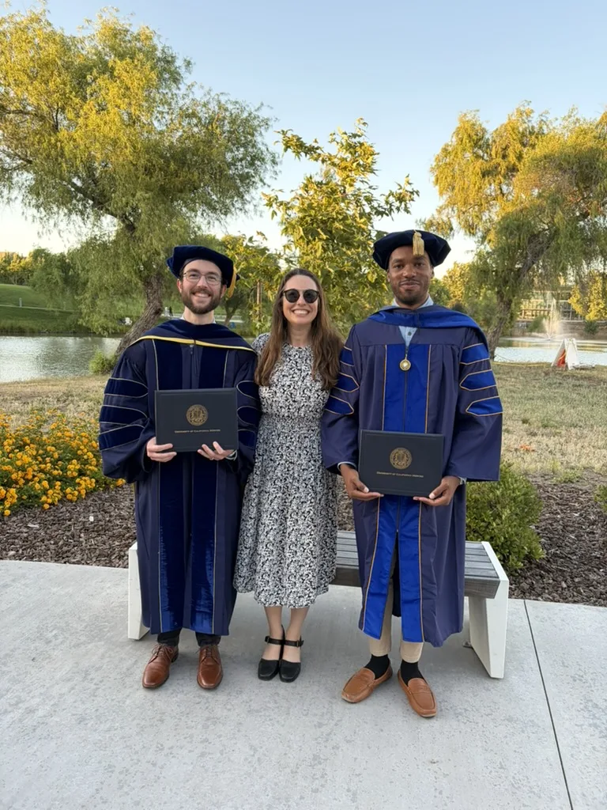{.gallery-image fig-alt="LInC Lab PhD graduation, 2026"}](img/A5A8BC58-23D7-42C6-9783-C42E70C276E6_1_105_c.jpeg)
:::

::::
:::

::: {.gallery-section}
### LInC lab at CogSci 2025

:::: {.photo-gallery}

::: {.gallery-item}
[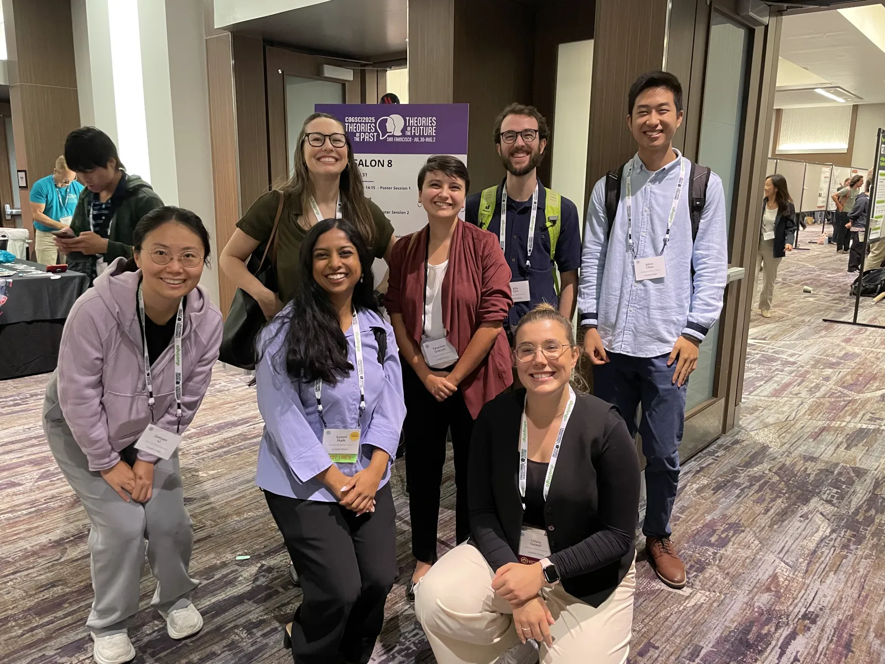{.gallery-image fig-alt="LInC Lab at CogSci 2025"}](img/CogSci2025_IMG_4916.jpeg)
:::

::: {.gallery-item}
[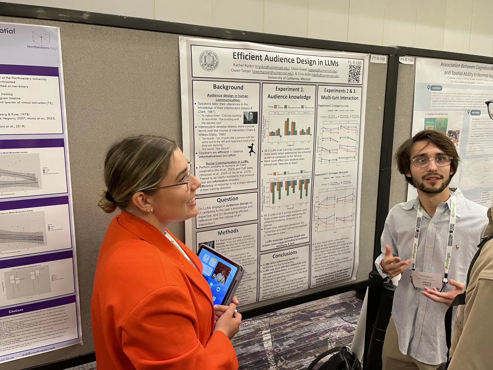{.gallery-image fig-alt="LInC Lab at CogSci 2025"}](img/CogSci2025_IMG_4904.jpeg)
:::

::: {.gallery-item}
[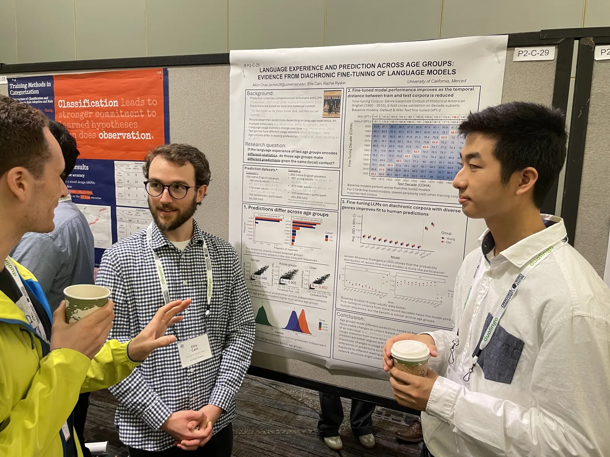{.gallery-image fig-alt="LInC Lab at CogSci 2025"}](img/CogSci2025_IMG_4906.jpeg)
:::

::: {.gallery-item}
[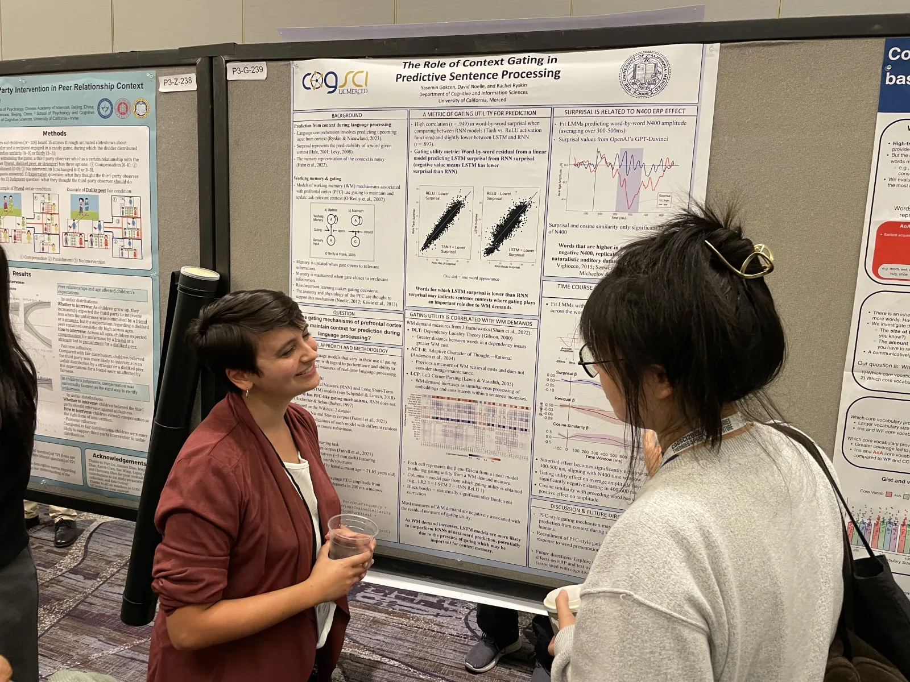{.gallery-image fig-alt="LInC Lab at CogSci 2025"}](img/CogSci2025_IMG_4909.jpeg)
:::

::: {.gallery-item}
[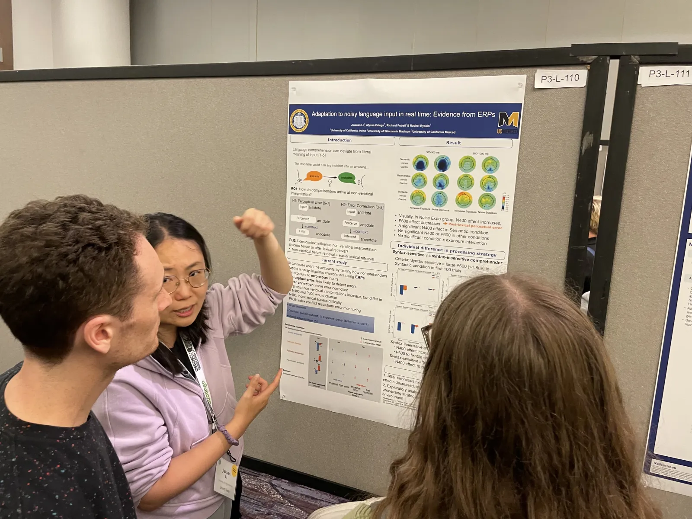{.gallery-image fig-alt="LInC Lab at CogSci 2025"}](img/CogSci2025_IMG_4910.jpeg)
:::

::: {.gallery-item}
[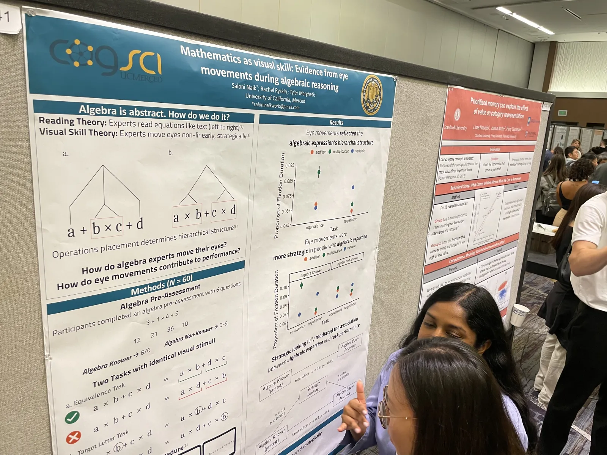{.gallery-image fig-alt="LInC Lab at CogSci 2025"}](img/CogSci2025_IMG_4912.jpeg)
:::

::::
:::

::: {.gallery-section}
### Spring 2024

:::: {.photo-gallery}

::: {.gallery-item}
[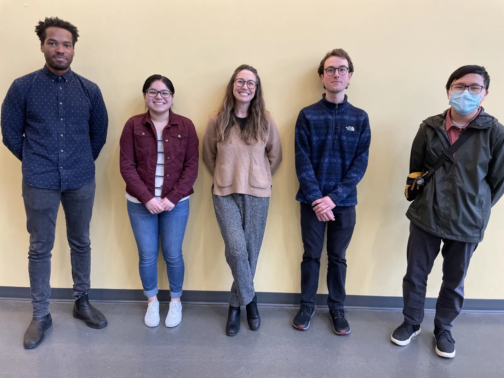{.gallery-image fig-alt="LInC Lab group photo, Spring 2024"}](img/spring2024_lab_photo_normal.jpg)
:::

::: {.gallery-item}
[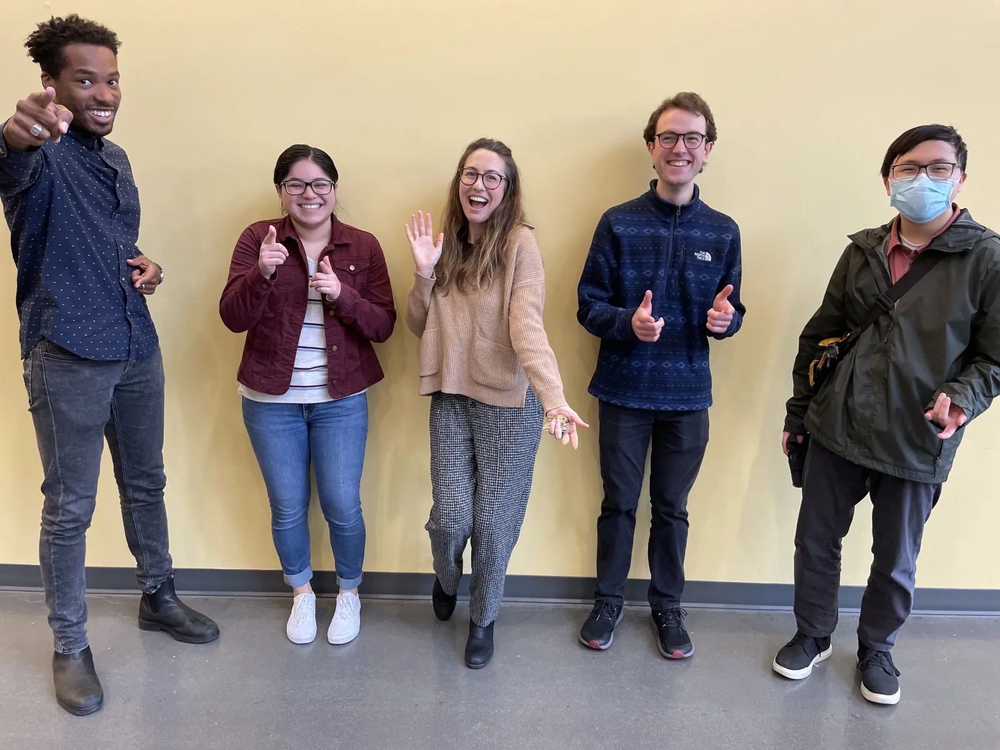{.gallery-image fig-alt="LInC Lab group photo, Spring 2024"}](img/spring2024_lab_photo_funny.jpg)
:::

::::
:::

::: {.gallery-section}
### Joint LInC/Marghetis Lab Pizza lunch (Fall 2021)

:::: {.photo-gallery}

::: {.gallery-item}
[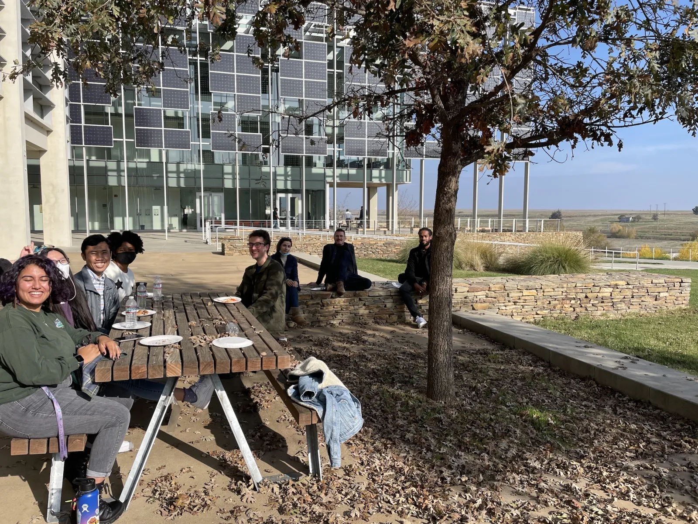{.gallery-image fig-alt="Joint LInC and Marghetis Lab pizza lunch, Fall 2021"}](img/fall2021_pizza.jpg)
:::

::: {.gallery-item}
[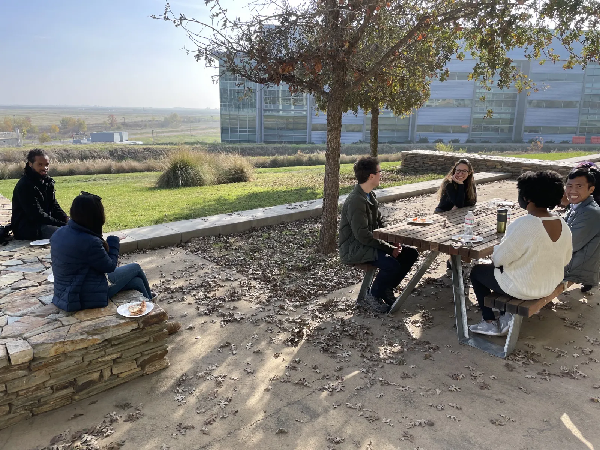{.gallery-image fig-alt="Joint LInC and Marghetis Lab pizza lunch, Fall 2021"}](img/fall2021_pizza2.jpg)
:::

::::
:::
